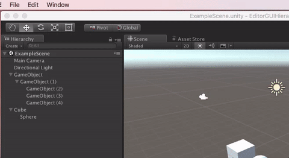

# Editor GUI Hierarchy View

EditorGUIHierarchyView is an utility view that allows you to easily add a hierarchy view (think Unity's scene view) to your Editor Windows.



## Features

* Keyboard cycling (move up/down, open/close with key arrows)
* Item selection
* Multiple selection (cmd+click to select multiple items)
* Text coloring (for both selected and unselected states)


## Example

```csharp

EditorGUIHierarchyView hierarchyView = new EditorGUIHierarchyView();

public void OnGUI ()
{
	hierarchyView.BeginHierarchyView ();

	hierarchyView.BeginNode ("Select me");
		hierarchyView.Node ("Child");
		hierarchyView.BeginNode ("Another parent");
			hierarchyView.Node ("Grandson");
		hierarchyView.EndNode ();
	hierarchyView.EndNode ();

	hierarchyView.Node ("No children");
	hierarchyView.Node ("Hello");

	hierarchyView.EndHierarchyView ();

	Repaint ();
}
```

